<!-- toc -->

# 首次接入流程
> 版本：1.0
> 时间：2020-12-21
> 创建者：wangcq01

## 一、平台第一次接入流程
用于SaaS平台第一次接入小程序PaaS，主要步骤如下：

## 二、接入流程说明
### 0 开通账号
请联系小程序PaaS平台PO开通“开发者控制台”账户。

### 1 初始化应用
在SaaS系统接入前，需要在小程序PaaS初始化一个应用。

必须的步骤为：“登录账户”->“创建应用"->"发布应用"。

可选的步骤为：“配置资源和环境”、“引用资源和设置环境”，用于资源私有化、引用业务组件和匹配SaaS研发环境。

如下图所示：

具体步骤如下：

#### 1.1登录账户
使用小程序PaaS提供的账号密码进行登录开发者控制台（https://minapp.mypaas.com.cn）：
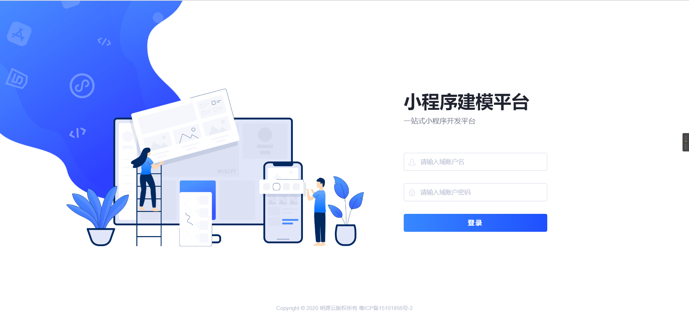
#### 1.2 配置资源和环境
用于SaaS接入的私有化配置、研发环境配置和注册组件资源（如果使用平台默认配置，可以跳过该步）。
##### 1.2.1 配置管理
###### 1.2.1.1 部署配置
入口为：[配置管理-部署配置](https://minapp.mypaas.com.cn/resource/deployment-config/list)。
用于自定义部署和版本相关的产物，典型的内容如：运行时元数据
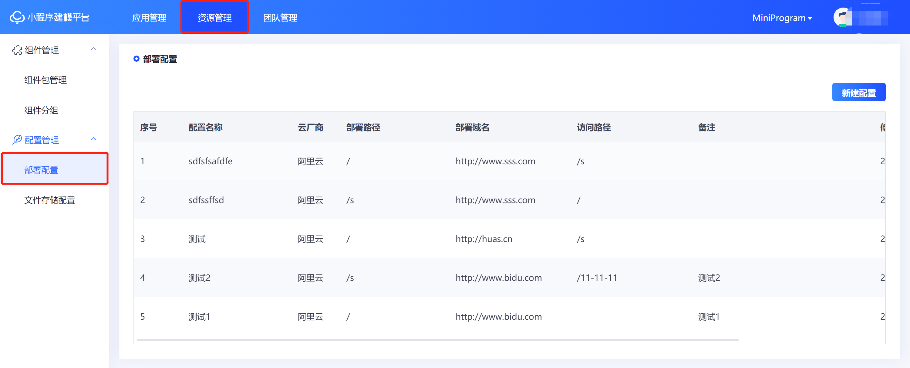
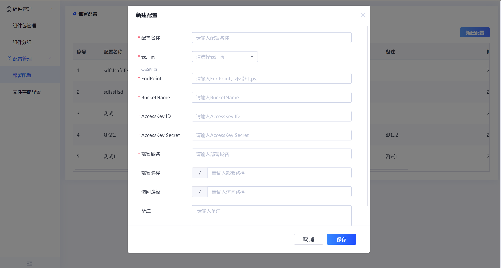
###### 1.2.1.2 文件存储配置
入口为：[配置管理-文件存储配置](https://minapp.mypaas.com.cn/resource/deployment-file/list)。
用于自定义存储和版本无关的文件，典型的内容如：图片

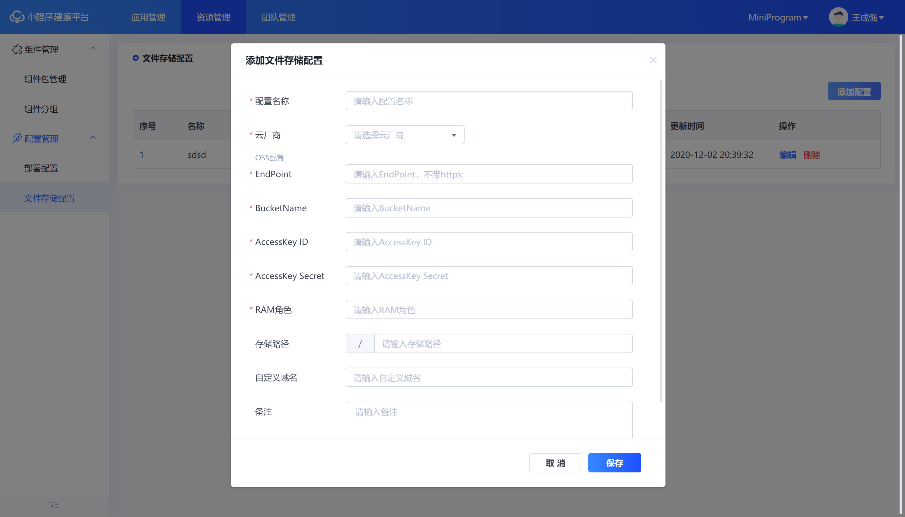

##### 1.2.3 注册组件包
用于注册SaaS团队开发的自定义组件，目前提供以组件包的方式进行注册（如果没有业务组件注册，可跳过该步骤）。
注意：注册组件包前需要联系小程序PaaS平台，以开通PaaS平台对该组件仓库的读取权限。
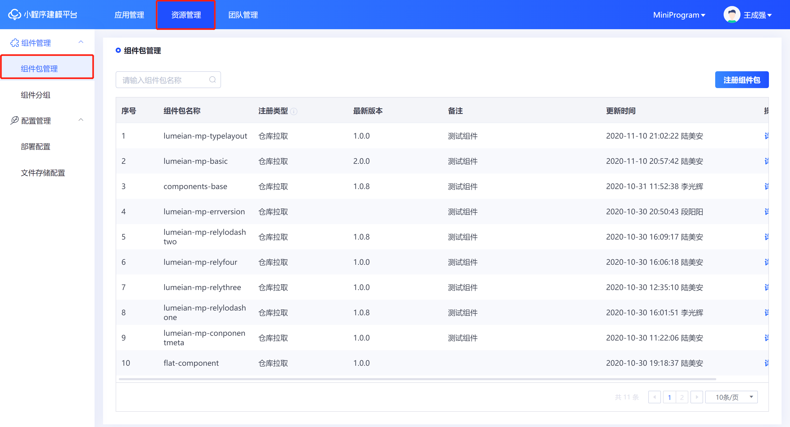

##### 1.2.3.1 编辑组件详情
组件包内的组件可进行组件详情的编辑，用于设计器内的组件展示：

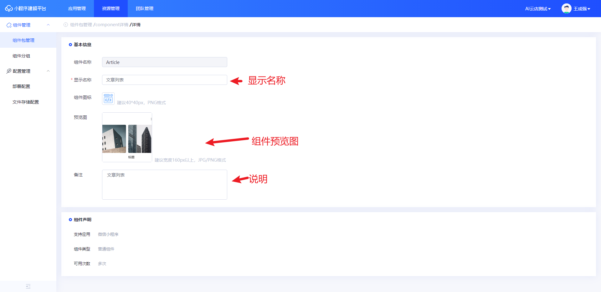

#### 1.3 创建应用
如下图所示，进行应用的创建
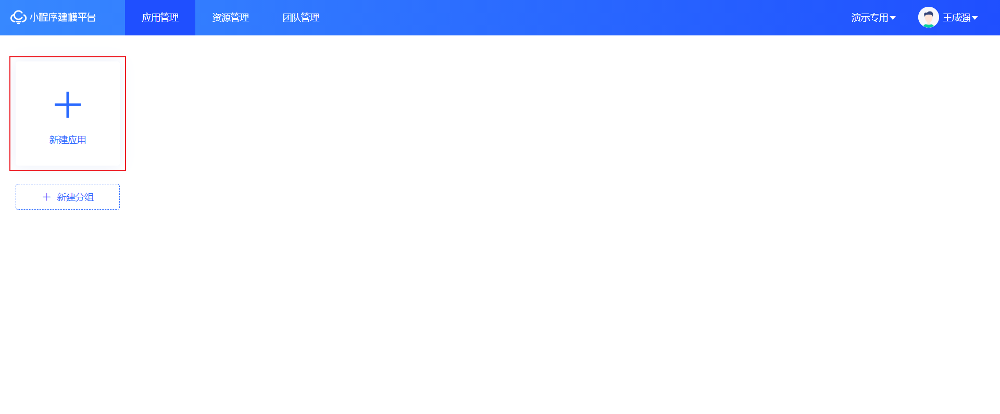
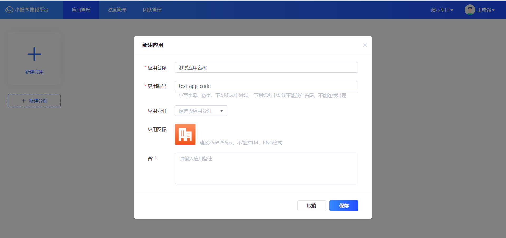

#### 1.4 引用资源和设置环境
创建完应用，可设置应用当前的业务环境和引用的组件资源（如果使用平台默认配置，可以跳过该步）。

##### 1.4.1 引用组件

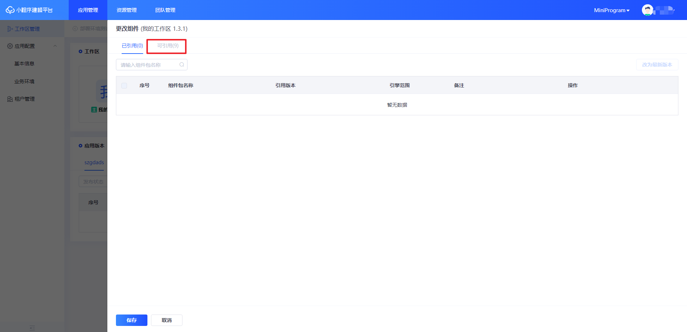
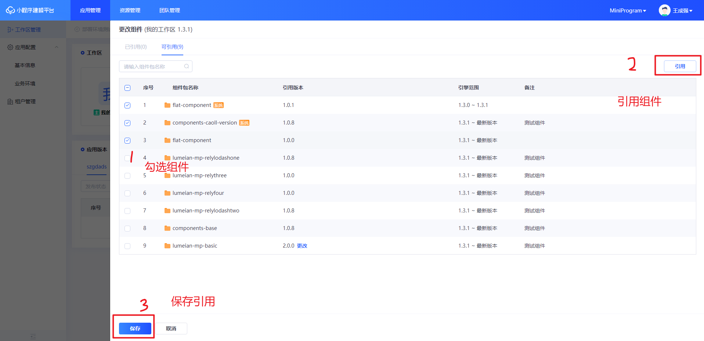

##### 1.4.2 创建/编辑业务环境
1、 业务环境对应SaaS研发流程，如SaaS系统有“开发”->“测试”->“预发布”->“生产”几个环境，则可在创建对应的环境，用于提供不同环境所需的配置项。

2、 部署配置和文件存储配置默认采用平台提供的公有云配置，有私有化需求则要提前在【资源管理-配置管理】中进行添加配置

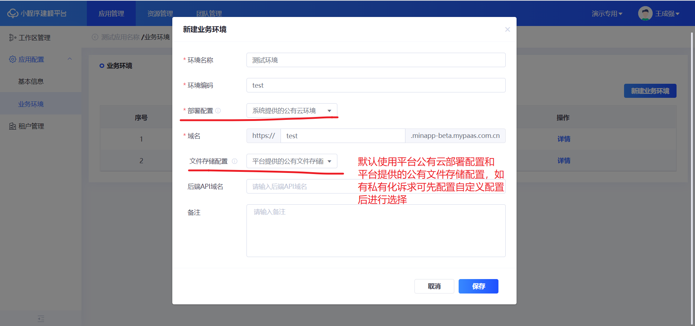

##### 1.4.3 设置业务环境

#### 1.5 发布应用版本
1）点击应用，进入开发者设计器，可进行应用的发布（目前开发者设计器还在完善中，仅提供应用发布功能）：
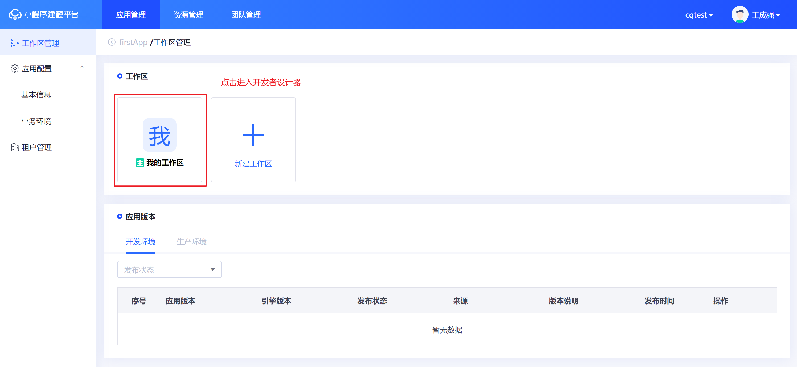
2）进入开发者设计器
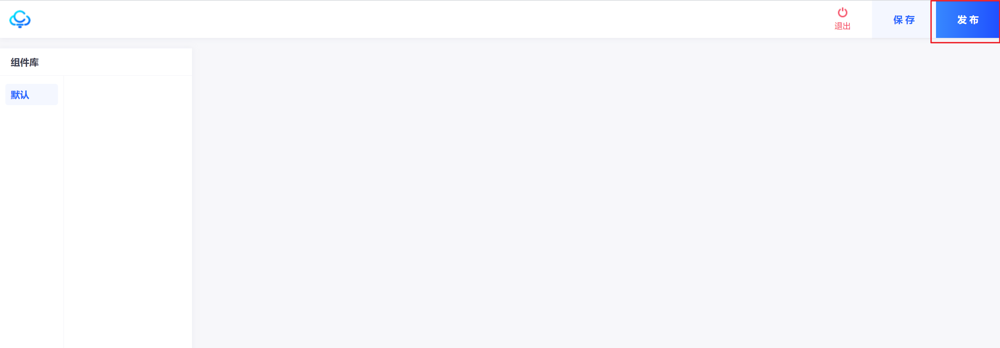
3）点击发布，出现发布界面，需要填入版本号，用以新建版本
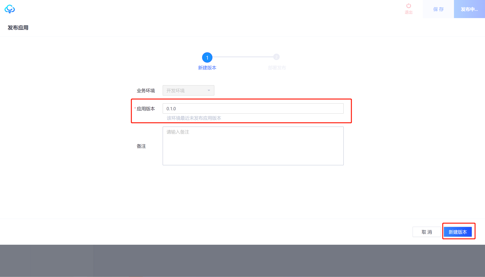
4）点击“新建版本”，等待完成，即可点击进行发布
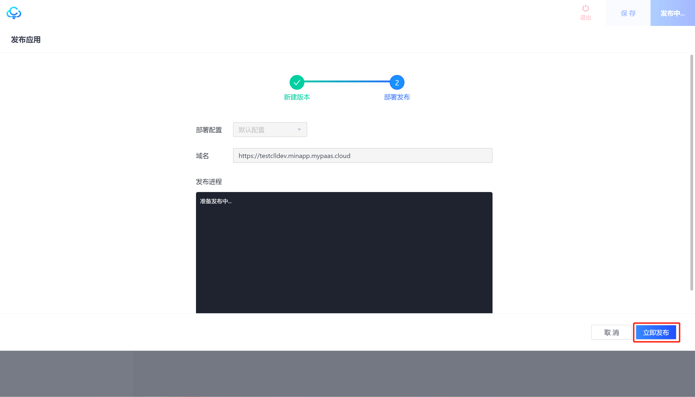
5）发布成功，点击确认，可回到设计器：
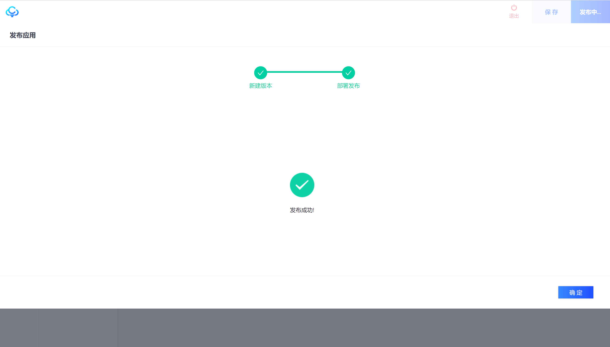
6）设计器内，点击“退出”，可回到【应用管理-工作区】

7）如下图所示，完成了应用版本的发布（指定环境），会自动设置成“线上版本”，SaaS创建租户应用时将以该版本为准：
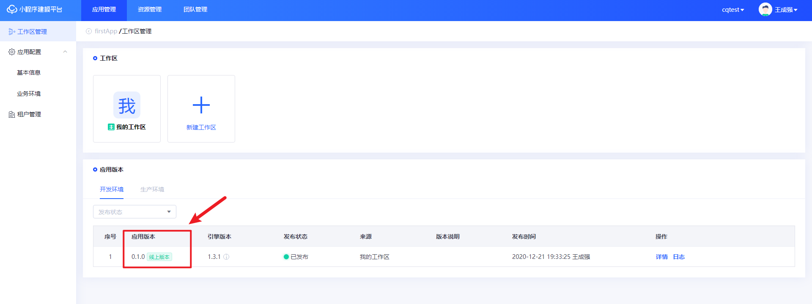

### 2 平台对接
平台对接需要准备以下内容：

|序号|名称|内容|说明|
|--|--|--|--|
|1|团队秘钥|appId、appSecret|小程序PaaS平台自动生成，用于openApi对接鉴权|
|2|应用编码|productAppCode|创建应用时填入，SaaS团队开发的小程序应用编码|
|3|环境编码|envCode|创建业务环境时填入，待对接小程序的环境编码|
|4|租户编码|tenentCode|SaaS平台传入，租户编码|
|5|租户应用编码|tenantAppCode|SaaS平台传入，租户应用编码|

#### 2.1 获取团队秘钥
入口：[团队管理-团队秘钥](https://minapp.mypaas.com.cn/team/secret)

#### 2.2 获取应用编码
入口：应用管理-工作区管理-应用配置-基本信息
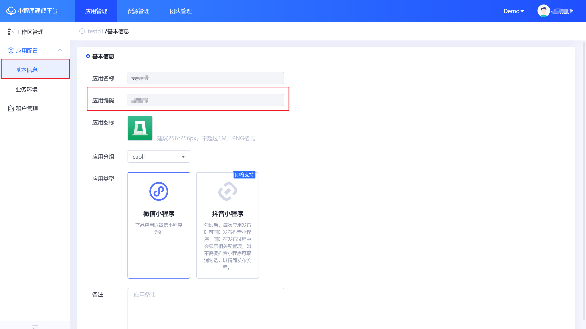
#### 2.3 获取环境编码

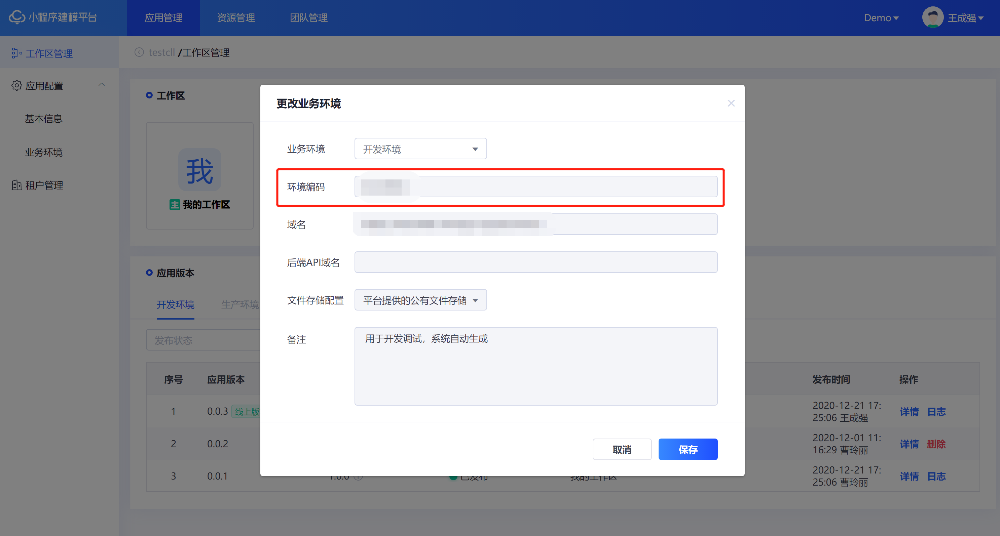
#### 2.4 对接openApi
##### 2.4.1 接口文档：[openApi接口文档](../平台应用API/README.md)
##### 2.4.2 对接流程（AI云店）
 1)云店适配方案:[《对接天际平台小程序PaaS》](https://shimo.im/docs/CwHXggrRxV9wXdxg/ )

 2)数据迁移方案:

### 3 同步租户数据
SaaS 平台调用 openAPI 同步

